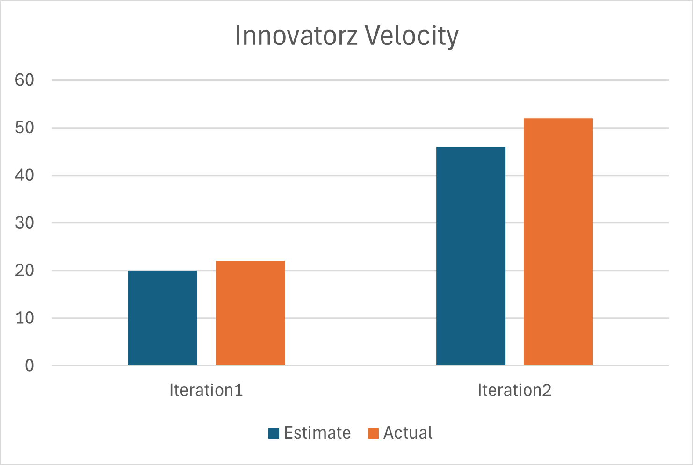

# Retrospective

Something that has not been as successful as we would have liked is that, despite having decent communication
as a group, the information we communicate is not as valuable to the advancement of the project as we would
like. We believe that we should have more meetings to make decisions on how to proceed and to have a better
task distribution, as that is something that has not been adequate enough. Additionally, we think that we
should have more code reviews throughout the iteration and not only at the end of it. This way we may have a
better understanding on how the other members are visualizing the implementation and whether or not our design
was appropriately clear. We also believe that we should be using more Test-Driven Development to produce better
code that satisfies our requirements, as it has proven to be useful so far.

Going forward, we will aim to have at least one outside-of-class meetings per week to stay on top of things. These
meetings will serve the purpose of doing code reviews and balance task distributions as needed. These improvements
will be deemed successful if we do indeed have said meetings and if all tasks are completed within 2 hours of the
estimated time of completion. The successful timely completions would indicate that the tasks were distributed in
the best possible manner.

## Velocity

